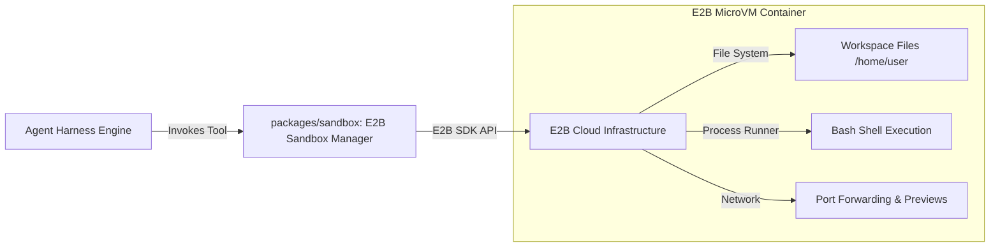

# 03 - E2B Sandbox Integration

## 🎯 Architectural Shift: Firecracker → E2B Cloud Sandbox

In the reference **Devin** codebase, sandbox execution requires a heavy infrastructure stack:
- **Firecracker microVMs** managed by a custom worker service (`apps/firecracker`).
- **Tool Gateway** gRPC proxy server (`apps/tool-gateway`) listening on port `9095`.
- Guest worker HTTP server inside each microVM (`apps/runtime`).
- AWS EKS / bare-metal host orchestration with complex networking & CNI.

**Loki** replaces this complex stack with **E2B Sandbox SDK** (`@e2b/code-interpreter` or `@e2b/desktop`). E2B provides secure, isolated Linux microVM sandboxes in the cloud with pre-installed developer tools, instant provisioning (<1s), file sync APIs, and remote command execution.

---

## 🏗️ Sandbox Module Architecture (`packages/sandbox`)



---

## 🛠️ Sandbox SDK Interface Definition

The `packages/sandbox` module exposes a clean typescript interface:

```typescript
export interface SandboxConfig {
  apiKey?: string;
  template?: string; // Default: 'base' or custom 'node-python-dev'
  timeoutMs?: number; // Default: 30 minutes
  metadata?: Record<string, string>;
}

export interface CommandResult {
  stdout: string;
  stderr: string;
  exitCode: number;
  error?: string;
}

export interface FileEntry {
  name: string;
  path: string;
  isDir: boolean;
  size?: number;
}

export interface ISandboxAdapter {
  init(config?: SandboxConfig): Promise<string>; // Returns sandboxId
  executeCommand(sandboxId: string, command: string, workDir?: string, timeoutMs?: number): Promise<CommandResult>;
  readFile(sandboxId: string, path: string): Promise<string>;
  writeFile(sandboxId: string, path: string, content: string): Promise<void>;
  listDir(sandboxId: string, path: string): Promise<FileEntry[]>;
  close(sandboxId: string): Promise<void>;
}
```

---

## 💻 Implementation Blueprint (`packages/sandbox/src/e2b-adapter.ts`)

Below is the concrete implementation of the E2B adapter using `@e2b/code-interpreter`:

```typescript
import { Sandbox } from "@e2b/code-interpreter";
import type { ISandboxAdapter, CommandResult, FileEntry } from "./types";

export class E2BSandboxAdapter implements ISandboxAdapter {
  private activeSandboxes = new Map<string, Sandbox>();

  async init(config?: SandboxConfig): Promise<string> {
    const apiKey = config?.apiKey || process.env.E2B_API_KEY;
    if (!apiKey) {
      throw new Error("E2B_API_KEY environment variable is missing.");
    }

    const sandbox = await Sandbox.create({
      apiKey,
      template: config?.template || "base",
      metadata: config?.metadata,
    });

    this.activeSandboxes.set(sandbox.sandboxId, sandbox);
    return sandbox.sandboxId;
  }

  private getSandbox(sandboxId: string): Sandbox {
    const sb = this.activeSandboxes.get(sandboxId);
    if (!sb) {
      throw new Error(`Sandbox session ${sandboxId} not found or active.`);
    }
    return sb;
  }

  async executeCommand(
    sandboxId: string,
    command: string,
    workDir = "/home/user/repo",
    timeoutMs = 60000
  ): Promise<CommandResult> {
    const sb = this.getSandbox(sandboxId);
    
    // Ensure working directory exists before running command
    await sb.commands.run(`mkdir -p ${workDir}`);

    const execution = await sb.commands.run(command, {
      cwd: workDir,
      timeoutMs,
    });

    return {
      stdout: execution.stdout,
      stderr: execution.stderr,
      exitCode: execution.exitCode ?? 0,
      error: execution.error ? execution.error.message : undefined,
    };
  }

  async readFile(sandboxId: string, path: string): Promise<string> {
    const sb = this.getSandbox(sandboxId);
    return await sb.files.read(path);
  }

  async writeFile(sandboxId: string, path: string, content: string): Promise<void> {
    const sb = this.getSandbox(sandboxId);
    
    // Ensure parent directory exists
    const parentDir = path.substring(0, path.lastIndexOf('/'));
    if (parentDir) {
      await sb.commands.run(`mkdir -p ${parentDir}`);
    }

    await sb.files.write(path, content);
  }

  async listDir(sandboxId: string, path: string): Promise<FileEntry[]> {
    const sb = this.getSandbox(sandboxId);
    const files = await sb.files.list(path);
    return files.map((f) => ({
      name: f.name,
      path: `${path}/${f.name}`,
      isDir: f.isDir,
    }));
  }

  async close(sandboxId: string): Promise<void> {
    const sb = this.activeSandboxes.get(sandboxId);
    if (sb) {
      await sb.kill();
      this.activeSandboxes.delete(sandboxId);
    }
  }
}
```

---

## ⚡ E2B Tool Execution Mapping in Harness

When the agent harness executes tools during turns, it maps them directly to `E2BSandboxAdapter`:

| Agent Tool Call | E2B Adapter Action | Output Sanitization |
| :--- | :--- | :--- |
| `read_file({ path })` | `adapter.readFile(sbId, path)` | Truncated to 46KB max + wrapped in `TOOL_RESULT` |
| `write_file({ path, content })` | `adapter.writeFile(sbId, path, content)` | Confirmation string: `Successfully wrote N bytes to <path>` |
| `list_dir({ path })` | `adapter.listDir(sbId, path)` | Formatted ASCII directory tree string |
| `shell({ command })` | `adapter.executeCommand(sbId, command)` | Checked by secret filter -> Stdout/Stderr |
| `git_commit({ message })` | `adapter.executeCommand(sbId, "git add . && git commit -m ...")` | Git commit sha & output string |

---

## ⚙️ Environment Configuration

Add the following key to `.env`:

```bash
# E2B Sandbox Credentials
E2B_API_KEY=e2b_xxxxxxxxxxxxxxxxxxxxxxxx
```

---

## 🔗 Related Notes
- [[00 - Architecture Index|Return to Index]]
- [[01 - System Architecture & Component Mapping|System Architecture]]
- [[02 - Agent Harness & Loop Design|Agent Harness Loop]]
- [[04 - Security & Trust Boundary|Next: Security & Trust Boundary]]
