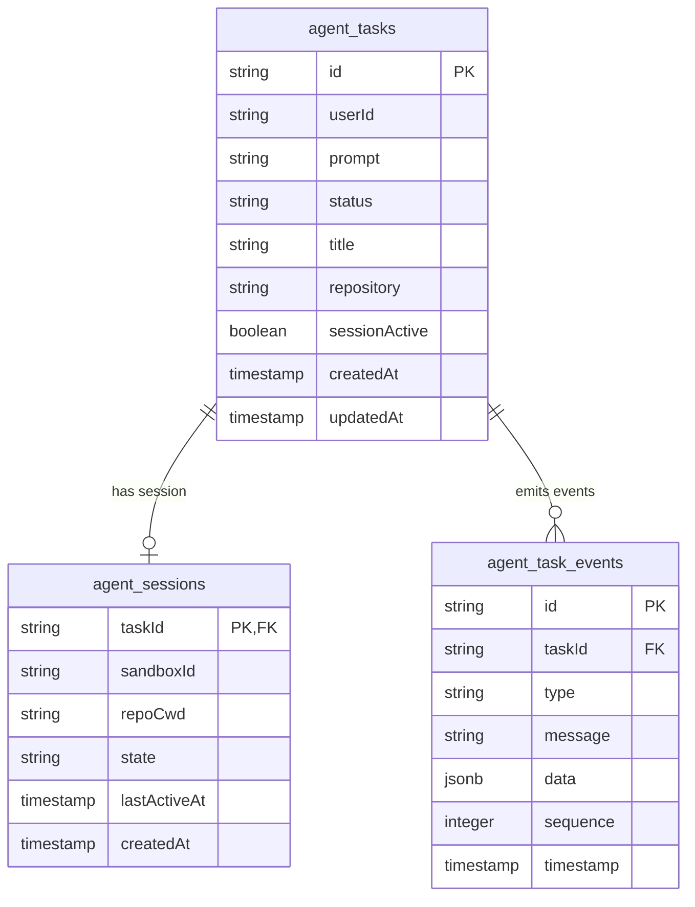

# 05 - Database & Event System

## 🎯 Overview

The persistence and streaming layer in **Loki** relies on **PostgreSQL** paired with **Drizzle ORM** (`packages/db`) and a strongly-typed **Event Bus** (`packages/events`). This guarantees durable task state, session recovery, audit history, and real-time streaming to frontends and CLI clients.

---

## 🗄️ 1. Database Schema (`packages/db/src/schema.ts`)

Loki uses three primary tables: `agent_tasks`, `agent_sessions`, and `agent_task_events`.



### TypeScript Schema Definition (Drizzle ORM)

```typescript
import { pgTable, text, timestamp, boolean, integer, jsonb, index } from "drizzle-orm/pg-core";
import { relations } from "drizzle-orm";

export const agentTasks = pgTable(
  "agent_tasks",
  {
    id: text("id").primaryKey(),
    userId: text("user_id"),
    prompt: text("prompt").notNull(),
    agent: text("agent").default("loki").notNull(),
    status: text("status").notNull(), // 'pending' | 'running' | 'completed' | 'failed' | 'cancelled'
    title: text("title"),
    repository: text("repository"),
    branch: text("branch"),
    sessionActive: boolean("session_active").default(false).notNull(),
    sandboxId: text("sandbox_id"),
    createdAt: timestamp("created_at").defaultNow().notNull(),
    updatedAt: timestamp("updated_at").defaultNow().notNull(),
  },
  (table) => [
    index("agent_tasks_user_id_idx").on(table.userId),
    index("agent_tasks_status_idx").on(table.status),
  ]
);

export const agentSessions = pgTable(
  "agent_sessions",
  {
    taskId: text("task_id")
      .primaryKey()
      .references(() => agentTasks.id, { onDelete: "cascade" }),
    sandboxId: text("sandbox_id").notNull(),
    repoCwd: text("repo_cwd").notNull().default("/home/user/repo"),
    state: text("state").notNull().default("active"), // 'active' | 'hibernated' | 'closed'
    lastActiveAt: timestamp("last_active_at").defaultNow().notNull(),
    createdAt: timestamp("created_at").defaultNow().notNull(),
  },
  (table) => [index("agent_sessions_state_idx").on(table.state)]
);

export const agentTaskEvents = pgTable(
  "agent_task_events",
  {
    id: text("id").primaryKey(),
    taskId: text("task_id")
      .notNull()
      .references(() => agentTasks.id, { onDelete: "cascade" }),
    type: text("type").notNull(), // 'agent.started' | 'agent.thought' | 'agent.tool' | 'agent.output' | 'agent.completed' | 'agent.failed'
    message: text("message").notNull(),
    data: jsonb("data"),
    sequence: integer("sequence").notNull(),
    timestamp: timestamp("timestamp").defaultNow().notNull(),
  },
  (table) => [
    index("agent_task_events_task_id_idx").on(table.taskId),
    index("agent_task_events_task_seq_idx").on(table.taskId, table.sequence),
  ]
);

// Drizzle Relations
export const agentTasksRelations = relations(agentTasks, ({ many, one }) => ({
  events: many(agentTaskEvents),
  session: one(agentSessions),
}));
```

---

## 📡 2. Event Types & Stream Contract (`packages/events`)

Events represent every granular action taken by the agent harness during task execution.

```typescript
export type AgentEventType =
  | "agent.started"
  | "agent.thought"
  | "agent.tool"
  | "agent.output"
  | "agent.log"
  | "agent.completed"
  | "agent.failed";

export interface AgentEvent {
  id: string;
  taskId: string;
  type: AgentEventType;
  message: string;
  data?: Record<string, unknown>;
  sequence: number;
  timestamp: string;
}
```

---

## 🔄 3. Event Bus & Real-Time Pipeline

```mermaid
graph LR
    Harness[Agent Harness Engine] -->|1. emitEvent()| EventBus[packages/events: EventBus]
    EventBus -->|2. Store in DB| DB[Postgres agent_task_events]
    EventBus -->|3. Broadcast| Sub[EventEmitter / PubSub]
    Sub -->|4. SSE / WebSockets| Server[apps/server API]
    Server -->|5. Stream to UI| Client[Web Dashboard / CLI]
```

### Event Emitter Implementation

```typescript
import { EventEmitter } from "node:events";
import type { AgentEvent } from "./types";

export class TaskEventBus extends EventEmitter {
  private static instance: TaskEventBus;

  private constructor() {
    super();
  }

  public static getInstance(): TaskEventBus {
    if (!TaskEventBus.instance) {
      TaskEventBus.instance = new TaskEventBus();
    }
    return TaskEventBus.instance;
  }

  public emitTaskEvent(event: AgentEvent): void {
    this.emit(`task:${event.taskId}`, event);
    this.emit("global:event", event);
  }

  public subscribeToTask(taskId: string, handler: (event: AgentEvent) => void): void {
    this.on(`task:${taskId}`, handler);
  }

  public unsubscribeFromTask(taskId: string, handler: (event: AgentEvent) => void): void {
    this.off(`task:${taskId}`, handler);
  }
}
```

---

## 🔗 Related Notes
- [[00 - Architecture Index|Return to Index]]
- [[01 - System Architecture & Component Mapping|System Architecture]]
- [[04 - Security & Trust Boundary|Security & Trust Boundary]]
- [[06 - Implementation Roadmap for Subagents|Next: Implementation Roadmap]]
