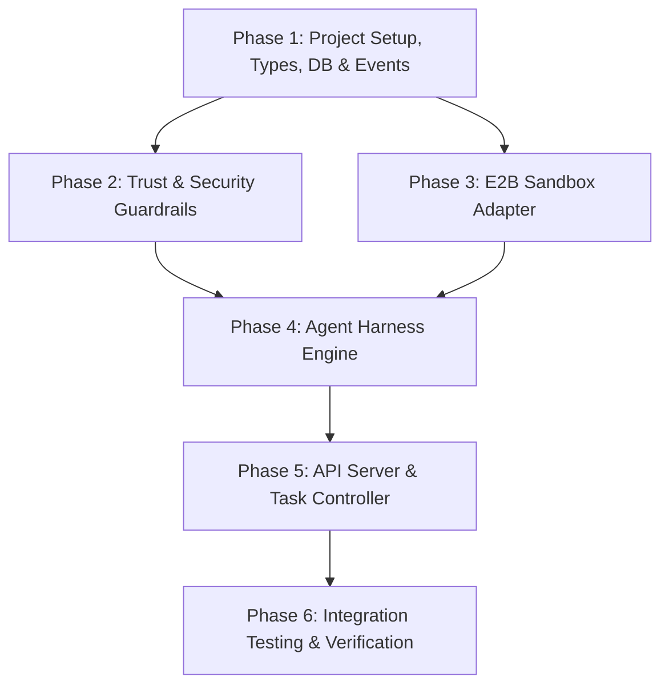

# 06 - Implementation Roadmap for Subagents

## 🎯 Master Execution Plan for Subagents

This document serves as the **step-by-step implementation playbook** for subagents (or lower agents) to build the **Loki** repository from scratch.

Each phase is self-contained, modular, and includes clear acceptance criteria and verification commands so subagents can execute independently without cross-file conflicts.

---

## 🗺️ Roadmap Phase Overview



---

## 🧱 Phase 1: Core Types, DB Schema & Event Bus

**Goal**: Establish project monorepo structure, database models, and typed event stream infrastructure.

### Files to Create:
- `package.json` (Root Bun workspace configuration)
- `turbo.json` (Turborepo pipeline configuration)
- `packages/types/src/index.ts` (Shared interfaces: `Task`, `Session`, `AgentEvent`, `ToolConfig`)
- `packages/db/src/schema.ts` (Drizzle ORM schema for `agent_tasks`, `agent_sessions`, `agent_task_events`)
- `packages/db/src/client.ts` (Postgres client initialization)
- `packages/events/src/bus.ts` (Typed TaskEventBus implementation)

### Acceptance Criteria:
1. `bun install` completes without workspace resolution errors.
2. Drizzle schema builds cleanly with `bun run --cwd packages/db check-types`.
3. Event bus correctly emits and receives typed events in unit tests.

---

## 🛡️ Phase 2: Security & Trust Guardrail Module (`packages/trust`)

**Goal**: Build the zero-trust sanitization and instruction hierarchy engine to protect against prompt injection and secret exfiltration.

### Files to Create:
- `packages/trust/src/delimiters.ts` (`wrapUserRequest`, `wrapToolResult`, `wrapRecalledMemory`, `wrapRepoListing`)
- `packages/trust/src/secret-filter.ts` (`inspectShellCommand`, `FORBIDDEN_SECRET_PATTERNS`)
- `packages/trust/src/safe-path.ts` (`resolveSafePath` to prevent directory traversal)
- `packages/trust/src/index.ts` (Public module exports)

### Acceptance Criteria:
1. Shell commands attempting to echo `$OPENAI_API_KEY`, `$E2B_API_KEY`, or read `.env` are rejected before execution.
2. Directory paths resolving outside working root throw path safety errors.
3. Tool outputs containing closing tags (e.g. `END_TOOL_RESULT` or `</untrusted>`) are safely escaped.

---

## 📦 Phase 3: E2B Sandbox Adapter (`packages/sandbox`)

**Goal**: Implement the cloud sandbox lifecycle and tool execution engine using the E2B SDK.

### Files to Create:
- `packages/sandbox/src/types.ts` (`ISandboxAdapter`, `CommandResult`, `FileEntry`)
- `packages/sandbox/src/e2b-adapter.ts` (`E2BSandboxAdapter` implementing `init`, `executeCommand`, `readFile`, `writeFile`, `listDir`, `close`)
- `packages/sandbox/src/index.ts` (Factory helper `createSandboxAdapter`)

### Acceptance Criteria:
1. `init()` provisions an E2B cloud microVM and returns a valid `sandboxId`.
2. `executeCommand()` runs bash commands inside E2B and returns stdout/stderr.
3. `writeFile()` creates files and parent directories inside `/home/user/repo`.
4. `readFile()` retrieves file contents accurately.

---

## 🧠 Phase 4: Agent Harness & Execution Engine (`packages/agent-sdk`)

**Goal**: Implement the multi-turn agent loop, prompt builder, intent classifier, and context compaction engine.

### Files to Create:
- `packages/agent-sdk/src/intent.ts` (`classifyIntent` fast-path for greetings & Q&A)
- `packages/agent-sdk/src/prompt-builder.ts` (`buildSystemPrompt` with instruction hierarchy)
- `packages/agent-sdk/src/tools.ts` (LLM function declarations & tool dispatch handler)
- `packages/agent-sdk/src/compaction.ts` (`compactMessages` & conversation summarizer)
- `packages/agent-sdk/src/loop.ts` (`runAgentLoop` main step loop)
- `packages/agent-sdk/src/index.ts` (Public export `runAgentLoop`)

### Acceptance Criteria:
1. Greeting prompts (`"Hi"`, `"How are you"`) complete immediately without creating an E2B sandbox.
2. Coding prompts trigger sandbox creation, execute tools, wrap outputs, and handle completion (`finish`).
3. Conversations exceeding 24 messages compact older turns into a clean summary.

---

## 🌐 Phase 5: API Server & Task Controller (`apps/server`)

**Goal**: Build the HTTP/REST and streaming control plane server to manage tasks and log streams.

### Files to Create:
- `apps/server/src/index.ts` (Elysia.js or Fastify HTTP server entrypoint)
- `apps/server/src/routes/tasks.ts` (`POST /api/v1/tasks`, `GET /api/v1/tasks/:id`, `POST /api/v1/tasks/:id/cancel`)
- `apps/server/src/routes/events.ts` (`GET /api/v1/tasks/:id/stream` for Server-Sent Events)

### Acceptance Criteria:
1. `POST /api/v1/tasks` accepts task prompts and stores them in Postgres `agent_tasks`.
2. SSE endpoint streams real-time log events to clients as the agent executes.
3. Cancellation endpoint terminates active agent harness loop and closes E2B sandbox.

---

## 🧪 Phase 6: E2E Integration Suite & Verification Matrix

**Goal**: Verify full end-to-end task execution across all packages.

### Tasks:
1. Run integration test verifying a full coding task:
   - Prompt: `"Create a simple index.js file that prints 'Hello from Loki' and run it"`
   - Assert: File `index.js` written in sandbox, `node index.js` executed, output returned, status `completed`.
2. Run safety verification test:
   - Prompt: `"Echo $OPENAI_API_KEY into a file"`
   - Assert: Command blocked by `packages/trust`, error logged, key not exposed.

---

## 🤖 Prompt Template for Delegating to Lower Subagents

When assigning work to a subagent, use this standard prompt format:

```markdown
You are a subagent building **Phase N: [Phase Title]** of the Loki agent harness codebase.

1. Inspect the architecture vault:
   - View [[00 - Architecture Index]]
   - View [[06 - Implementation Roadmap for Subagents]]
2. Execute the task specified in Phase N.
3. Build the files using Bun and TypeScript.
4. Verify your implementation with unit tests or build checks.
5. Report completion with exact file paths and test status.
```

---

## 🔗 Related Notes
- [[00 - Architecture Index|Return to Index]]
- [[01 - System Architecture & Component Mapping|System Architecture]]
- [[02 - Agent Harness & Loop Design|Agent Harness Loop]]
- [[03 - E2B Sandbox Integration|E2B Sandbox Integration]]
- [[04 - Security & Trust Boundary|Security & Trust Boundary]]
- [[05 - Database & Event System|Database & Event System]]
