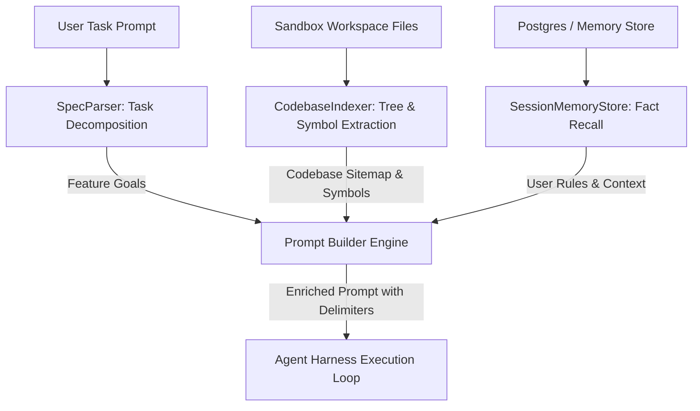

# 07 - Advanced Tooling & Context Engine

## 🎯 Overview

This document specifies the **Context-Driven Development (CDD)** layer and expanded developer tool suite for **Loki**.

CDD bridges high-level user feature requests and deep codebase execution by automatically scanning project structures, generating symbol sitemaps, decomposing requirements into structured goal specifications, and persisting user memory across agent sessions.

---

## 🏗️ Context-Driven Development (CDD) Architecture



---

## 🧠 1. CDD Components (`packages/context-engine`)

### `CodebaseIndexer`
- Scans directory paths (defaulting to `/home/user/repo`).
- Filters out noise (`node_modules`, `.git`, `dist`, `.next`, `build`).
- Extracts relative file trees, line counts, and top-level exported functions/classes.
- Produces compact ASCII sitemaps wrapped in `<untrusted source="codebase_context">`.

### `SpecParser`
- Parses complex multi-step feature prompts into structured specifications:
  - `title`: Short task goal.
  - `subGoals`: Step-by-step technical breakdown.
  - `acceptanceCriteria`: Specific conditions for task completion.

### `SessionMemoryStore`
- Manages persistent facts, architectural preferences, and past bug fixes.
- Filters out prompt injection attempts (`ignore previous instructions`, `system prompt overrides`).
- Injects memory blocks wrapped in `<untrusted source="recalled_memory">`.

---

## 🛠️ 2. Expanded Developer Tool Declarations

Loki's tool suite is expanded beyond basic file reading/writing to include high-efficiency code investigation and editing tools:

| Tool Name | Parameters | Purpose | E2B Execution Backend |
| :--- | :--- | :--- | :--- |
| `grep_search` | `query`, `path`, `glob` | Fast regex pattern search across files | Executes `grep -rn <query> <path>` or `ripgrep` |
| `find_files` | `pattern`, `path` | Find matching file names in directory tree | Executes `find <path> -name <pattern>` |
| `replace_file_content` | `path`, `target_content`, `replacement_content` | Precision string block replacement | Reads file, replaces exact match string, writes back |
| `git_diff` | `branch`, `path` | View unstaged or branch file changes | Executes `git diff <branch> -- <path>` |
| `fetch_url` | `url` | Retrieve public documentation or API specs | Fetches HTTP text content and strips HTML tags |

---

## 🔒 Security & Delimiters for CDD

Context generated by CDD components is classified as untrusted data:

```markdown
<untrusted source="codebase_context">
PROJECT STRUCTURE:
- src/index.ts (45 lines) - Exports: runAgentLoop, buildSystemPrompt
- src/tools.ts (120 lines) - Exports: TOOL_DECLARATIONS, executeAgentTool
</untrusted>

<untrusted source="feature_specification">
FEATURE SPECIFICATION:
Goal: Implement authentication middleware
Sub-goals:
1. Create JWT token verification function in src/auth.ts
2. Add middleware wrapper to HTTP endpoints
Acceptance Criteria:
- Invalid tokens return 401 Unauthorized
</untrusted>
```

---

## 🔗 Related Notes
- [[00 - Architecture Index|Return to Index]]
- [[01 - System Architecture & Component Mapping|System Architecture]]
- [[02 - Agent Harness & Loop Design|Agent Harness Loop]]
- [[06 - Implementation Roadmap for Subagents|Implementation Roadmap]]
